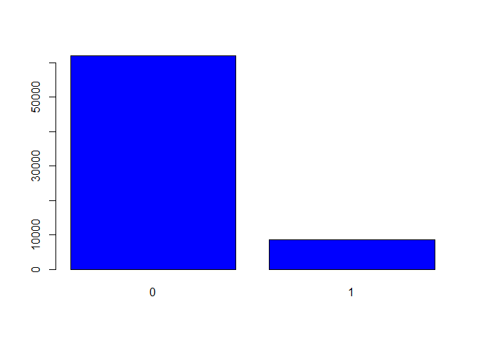
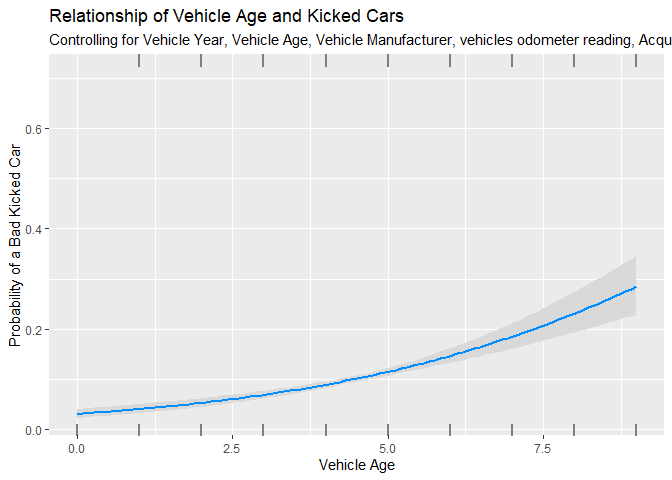
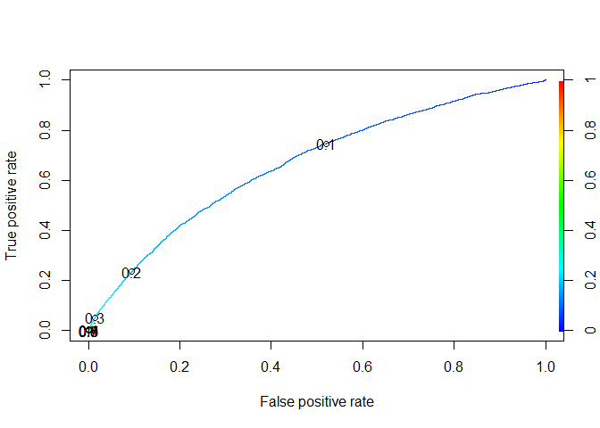

Don’t Get Kicked
================
Wiroon Bowonthanasan
5/4/2020

## Loading Datasets

``` r
require(tidyverse)
```

    ## Loading required package: tidyverse

    ## -- Attaching packages -------------------------------------------------------------------------------------------------- tidyverse 1.3.0 --

    ## v ggplot2 3.2.1     v purrr   0.3.3
    ## v tibble  2.1.3     v dplyr   0.8.4
    ## v tidyr   1.0.2     v stringr 1.4.0
    ## v readr   1.3.1     v forcats 0.4.0

    ## -- Conflicts ----------------------------------------------------------------------------------------------------- tidyverse_conflicts() --
    ## x dplyr::filter() masks stats::filter()
    ## x dplyr::lag()    masks stats::lag()

``` r
train_kicked=read_csv('C:/Users/wiroo/Documents/SCHOOL/Pace/Data Mining Algorithms and Applications/DontGetKicked/training.csv')
```

    ## Parsed with column specification:
    ## cols(
    ##   .default = col_character(),
    ##   RefId = col_double(),
    ##   IsBadBuy = col_double(),
    ##   VehYear = col_double(),
    ##   VehicleAge = col_double(),
    ##   VehOdo = col_double(),
    ##   BYRNO = col_double(),
    ##   VNZIP1 = col_double(),
    ##   VehBCost = col_double(),
    ##   IsOnlineSale = col_double(),
    ##   WarrantyCost = col_double()
    ## )

    ## See spec(...) for full column specifications.

``` r
test_kicked=read_csv('C:/Users/wiroo/Documents/SCHOOL/Pace/Data Mining Algorithms and Applications/DontGetKicked/test.csv')
```

    ## Parsed with column specification:
    ## cols(
    ##   .default = col_character(),
    ##   RefId = col_double(),
    ##   VehYear = col_double(),
    ##   VehicleAge = col_double(),
    ##   VehOdo = col_double(),
    ##   MMRAcquisitionAuctionAveragePrice = col_double(),
    ##   MMRAcquisitionAuctionCleanPrice = col_double(),
    ##   MMRAcquisitionRetailAveragePrice = col_double(),
    ##   MMRAcquisitonRetailCleanPrice = col_double(),
    ##   BYRNO = col_double(),
    ##   VNZIP1 = col_double(),
    ##   VehBCost = col_double(),
    ##   IsOnlineSale = col_double(),
    ##   WarrantyCost = col_double()
    ## )
    ## See spec(...) for full column specifications.

    ## Warning: 40 parsing failures.
    ##  row                               col expected actual                                                                                                  file
    ## 2316 MMRAcquisitionAuctionAveragePrice a double   NULL 'C:/Users/wiroo/Documents/SCHOOL/Pace/Data Mining Algorithms and Applications/DontGetKicked/test.csv'
    ## 2316 MMRAcquisitionAuctionCleanPrice   a double   NULL 'C:/Users/wiroo/Documents/SCHOOL/Pace/Data Mining Algorithms and Applications/DontGetKicked/test.csv'
    ## 2316 MMRAcquisitionRetailAveragePrice  a double   NULL 'C:/Users/wiroo/Documents/SCHOOL/Pace/Data Mining Algorithms and Applications/DontGetKicked/test.csv'
    ## 2316 MMRAcquisitonRetailCleanPrice     a double   NULL 'C:/Users/wiroo/Documents/SCHOOL/Pace/Data Mining Algorithms and Applications/DontGetKicked/test.csv'
    ## 2418 MMRAcquisitionAuctionAveragePrice a double   NULL 'C:/Users/wiroo/Documents/SCHOOL/Pace/Data Mining Algorithms and Applications/DontGetKicked/test.csv'
    ## .... ................................. ........ ...... .....................................................................................................
    ## See problems(...) for more details.

``` r
train_kicked
```

    ## # A tibble: 72,983 x 34
    ##    RefId IsBadBuy PurchDate Auction VehYear VehicleAge Make  Model Trim 
    ##    <dbl>    <dbl> <chr>     <chr>     <dbl>      <dbl> <chr> <chr> <chr>
    ##  1     1        0 12/7/2009 ADESA      2006          3 MAZDA MAZD~ i    
    ##  2     2        0 12/7/2009 ADESA      2004          5 DODGE 1500~ ST   
    ##  3     3        0 12/7/2009 ADESA      2005          4 DODGE STRA~ SXT  
    ##  4     4        0 12/7/2009 ADESA      2004          5 DODGE NEON  SXT  
    ##  5     5        0 12/7/2009 ADESA      2005          4 FORD  FOCUS ZX3  
    ##  6     6        0 12/7/2009 ADESA      2004          5 MITS~ GALA~ ES   
    ##  7     7        0 12/7/2009 ADESA      2004          5 KIA   SPEC~ EX   
    ##  8     8        0 12/7/2009 ADESA      2005          4 FORD  TAUR~ SE   
    ##  9     9        0 12/7/2009 ADESA      2007          2 KIA   SPEC~ EX   
    ## 10    10        0 12/7/2009 ADESA      2007          2 FORD  FIVE~ SEL  
    ## # ... with 72,973 more rows, and 25 more variables: SubModel <chr>,
    ## #   Color <chr>, Transmission <chr>, WheelTypeID <chr>, WheelType <chr>,
    ## #   VehOdo <dbl>, Nationality <chr>, Size <chr>, TopThreeAmericanName <chr>,
    ## #   MMRAcquisitionAuctionAveragePrice <chr>,
    ## #   MMRAcquisitionAuctionCleanPrice <chr>,
    ## #   MMRAcquisitionRetailAveragePrice <chr>,
    ## #   MMRAcquisitonRetailCleanPrice <chr>, MMRCurrentAuctionAveragePrice <chr>,
    ## #   MMRCurrentAuctionCleanPrice <chr>, MMRCurrentRetailAveragePrice <chr>,
    ## #   MMRCurrentRetailCleanPrice <chr>, PRIMEUNIT <chr>, AUCGUART <chr>,
    ## #   BYRNO <dbl>, VNZIP1 <dbl>, VNST <chr>, VehBCost <dbl>, IsOnlineSale <dbl>,
    ## #   WarrantyCost <dbl>

``` r
test_kicked
```

    ## # A tibble: 48,707 x 33
    ##    RefId PurchDate Auction VehYear VehicleAge Make  Model Trim  SubModel Color
    ##    <dbl> <chr>     <chr>     <dbl>      <dbl> <chr> <chr> <chr> <chr>    <chr>
    ##  1 73015 12/2/2009 ADESA      2005          4 PONT~ GRAN~ Bas   4D SEDAN SILV~
    ##  2 73016 12/2/2009 ADESA      2005          4 CHEV~ MALI~ LS    4D SEDA~ SILV~
    ##  3 73017 12/2/2009 ADESA      2006          3 DODGE DURA~ Adv   4D SUV ~ SILV~
    ##  4 73018 12/2/2009 ADESA      2002          7 SATU~ L SE~ L20   4D SEDA~ GOLD 
    ##  5 73019 12/2/2009 ADESA      2007          2 HYUN~ ACCE~ GS    2D COUP~ BLUE 
    ##  6 73020 12/2/2009 ADESA      2006          3 DODGE STRA~ SXT   4D SEDAN GREEN
    ##  7 73021 12/2/2009 ADESA      2006          3 FORD  EXPL~ XLS   4D SUV ~ BROWN
    ##  8 73022 12/2/2009 ADESA      2003          6 CHRY~ PT C~ Tou   4D SEDA~ BLUE 
    ##  9 73023 12/2/2009 ADESA      2005          4 CHEV~ MALI~ Bas   4D SEDAN SILV~
    ## 10 73024 12/2/2009 ADESA      2006          3 CHRY~ TOWN~ Tou   MINIVAN~ WHITE
    ## # ... with 48,697 more rows, and 23 more variables: Transmission <chr>,
    ## #   WheelTypeID <chr>, WheelType <chr>, VehOdo <dbl>, Nationality <chr>,
    ## #   Size <chr>, TopThreeAmericanName <chr>,
    ## #   MMRAcquisitionAuctionAveragePrice <dbl>,
    ## #   MMRAcquisitionAuctionCleanPrice <dbl>,
    ## #   MMRAcquisitionRetailAveragePrice <dbl>,
    ## #   MMRAcquisitonRetailCleanPrice <dbl>, MMRCurrentAuctionAveragePrice <chr>,
    ## #   MMRCurrentAuctionCleanPrice <chr>, MMRCurrentRetailAveragePrice <chr>,
    ## #   MMRCurrentRetailCleanPrice <chr>, PRIMEUNIT <chr>, AUCGUART <chr>,
    ## #   BYRNO <dbl>, VNZIP1 <dbl>, VNST <chr>, VehBCost <dbl>, IsOnlineSale <dbl>,
    ## #   WarrantyCost <dbl>

## Preprocessing

``` r
#Checking the data structure

str(train_kicked) 
```

    ## Classes 'spec_tbl_df', 'tbl_df', 'tbl' and 'data.frame': 72983 obs. of  34 variables:
    ##  $ RefId                            : num  1 2 3 4 5 6 7 8 9 10 ...
    ##  $ IsBadBuy                         : num  0 0 0 0 0 0 0 0 0 0 ...
    ##  $ PurchDate                        : chr  "12/7/2009" "12/7/2009" "12/7/2009" "12/7/2009" ...
    ##  $ Auction                          : chr  "ADESA" "ADESA" "ADESA" "ADESA" ...
    ##  $ VehYear                          : num  2006 2004 2005 2004 2005 ...
    ##  $ VehicleAge                       : num  3 5 4 5 4 5 5 4 2 2 ...
    ##  $ Make                             : chr  "MAZDA" "DODGE" "DODGE" "DODGE" ...
    ##  $ Model                            : chr  "MAZDA3" "1500 RAM PICKUP 2WD" "STRATUS V6" "NEON" ...
    ##  $ Trim                             : chr  "i" "ST" "SXT" "SXT" ...
    ##  $ SubModel                         : chr  "4D SEDAN I" "QUAD CAB 4.7L SLT" "4D SEDAN SXT FFV" "4D SEDAN" ...
    ##  $ Color                            : chr  "RED" "WHITE" "MAROON" "SILVER" ...
    ##  $ Transmission                     : chr  "AUTO" "AUTO" "AUTO" "AUTO" ...
    ##  $ WheelTypeID                      : chr  "1" "1" "2" "1" ...
    ##  $ WheelType                        : chr  "Alloy" "Alloy" "Covers" "Alloy" ...
    ##  $ VehOdo                           : num  89046 93593 73807 65617 69367 ...
    ##  $ Nationality                      : chr  "OTHER ASIAN" "AMERICAN" "AMERICAN" "AMERICAN" ...
    ##  $ Size                             : chr  "MEDIUM" "LARGE TRUCK" "MEDIUM" "COMPACT" ...
    ##  $ TopThreeAmericanName             : chr  "OTHER" "CHRYSLER" "CHRYSLER" "CHRYSLER" ...
    ##  $ MMRAcquisitionAuctionAveragePrice: chr  "8155" "6854" "3202" "1893" ...
    ##  $ MMRAcquisitionAuctionCleanPrice  : chr  "9829" "8383" "4760" "2675" ...
    ##  $ MMRAcquisitionRetailAveragePrice : chr  "11636" "10897" "6943" "4658" ...
    ##  $ MMRAcquisitonRetailCleanPrice    : chr  "13600" "12572" "8457" "5690" ...
    ##  $ MMRCurrentAuctionAveragePrice    : chr  "7451" "7456" "4035" "1844" ...
    ##  $ MMRCurrentAuctionCleanPrice      : chr  "8552" "9222" "5557" "2646" ...
    ##  $ MMRCurrentRetailAveragePrice     : chr  "11597" "11374" "7146" "4375" ...
    ##  $ MMRCurrentRetailCleanPrice       : chr  "12409" "12791" "8702" "5518" ...
    ##  $ PRIMEUNIT                        : chr  "NULL" "NULL" "NULL" "NULL" ...
    ##  $ AUCGUART                         : chr  "NULL" "NULL" "NULL" "NULL" ...
    ##  $ BYRNO                            : num  21973 19638 19638 19638 19638 ...
    ##  $ VNZIP1                           : num  33619 33619 33619 33619 33619 ...
    ##  $ VNST                             : chr  "FL" "FL" "FL" "FL" ...
    ##  $ VehBCost                         : num  7100 7600 4900 4100 4000 5600 4200 4500 5600 7700 ...
    ##  $ IsOnlineSale                     : num  0 0 0 0 0 0 0 0 0 0 ...
    ##  $ WarrantyCost                     : num  1113 1053 1389 630 1020 ...
    ##  - attr(*, "spec")=
    ##   .. cols(
    ##   ..   RefId = col_double(),
    ##   ..   IsBadBuy = col_double(),
    ##   ..   PurchDate = col_character(),
    ##   ..   Auction = col_character(),
    ##   ..   VehYear = col_double(),
    ##   ..   VehicleAge = col_double(),
    ##   ..   Make = col_character(),
    ##   ..   Model = col_character(),
    ##   ..   Trim = col_character(),
    ##   ..   SubModel = col_character(),
    ##   ..   Color = col_character(),
    ##   ..   Transmission = col_character(),
    ##   ..   WheelTypeID = col_character(),
    ##   ..   WheelType = col_character(),
    ##   ..   VehOdo = col_double(),
    ##   ..   Nationality = col_character(),
    ##   ..   Size = col_character(),
    ##   ..   TopThreeAmericanName = col_character(),
    ##   ..   MMRAcquisitionAuctionAveragePrice = col_character(),
    ##   ..   MMRAcquisitionAuctionCleanPrice = col_character(),
    ##   ..   MMRAcquisitionRetailAveragePrice = col_character(),
    ##   ..   MMRAcquisitonRetailCleanPrice = col_character(),
    ##   ..   MMRCurrentAuctionAveragePrice = col_character(),
    ##   ..   MMRCurrentAuctionCleanPrice = col_character(),
    ##   ..   MMRCurrentRetailAveragePrice = col_character(),
    ##   ..   MMRCurrentRetailCleanPrice = col_character(),
    ##   ..   PRIMEUNIT = col_character(),
    ##   ..   AUCGUART = col_character(),
    ##   ..   BYRNO = col_double(),
    ##   ..   VNZIP1 = col_double(),
    ##   ..   VNST = col_character(),
    ##   ..   VehBCost = col_double(),
    ##   ..   IsOnlineSale = col_double(),
    ##   ..   WarrantyCost = col_double()
    ##   .. )

``` r
#Fixing the data.
train_kicked$IsBadBuy<- as.factor(train_kicked$IsBadBuy) #Changing to factor.
train_kicked<-na.omit(train_kicked) #Getting rid of NA values.

train_kicked
```

    ## # A tibble: 70,622 x 34
    ##    RefId IsBadBuy PurchDate Auction VehYear VehicleAge Make  Model Trim 
    ##    <dbl> <fct>    <chr>     <chr>     <dbl>      <dbl> <chr> <chr> <chr>
    ##  1     1 0        12/7/2009 ADESA      2006          3 MAZDA MAZD~ i    
    ##  2     2 0        12/7/2009 ADESA      2004          5 DODGE 1500~ ST   
    ##  3     3 0        12/7/2009 ADESA      2005          4 DODGE STRA~ SXT  
    ##  4     4 0        12/7/2009 ADESA      2004          5 DODGE NEON  SXT  
    ##  5     5 0        12/7/2009 ADESA      2005          4 FORD  FOCUS ZX3  
    ##  6     6 0        12/7/2009 ADESA      2004          5 MITS~ GALA~ ES   
    ##  7     7 0        12/7/2009 ADESA      2004          5 KIA   SPEC~ EX   
    ##  8     8 0        12/7/2009 ADESA      2005          4 FORD  TAUR~ SE   
    ##  9     9 0        12/7/2009 ADESA      2007          2 KIA   SPEC~ EX   
    ## 10    10 0        12/7/2009 ADESA      2007          2 FORD  FIVE~ SEL  
    ## # ... with 70,612 more rows, and 25 more variables: SubModel <chr>,
    ## #   Color <chr>, Transmission <chr>, WheelTypeID <chr>, WheelType <chr>,
    ## #   VehOdo <dbl>, Nationality <chr>, Size <chr>, TopThreeAmericanName <chr>,
    ## #   MMRAcquisitionAuctionAveragePrice <chr>,
    ## #   MMRAcquisitionAuctionCleanPrice <chr>,
    ## #   MMRAcquisitionRetailAveragePrice <chr>,
    ## #   MMRAcquisitonRetailCleanPrice <chr>, MMRCurrentAuctionAveragePrice <chr>,
    ## #   MMRCurrentAuctionCleanPrice <chr>, MMRCurrentRetailAveragePrice <chr>,
    ## #   MMRCurrentRetailCleanPrice <chr>, PRIMEUNIT <chr>, AUCGUART <chr>,
    ## #   BYRNO <dbl>, VNZIP1 <dbl>, VNST <chr>, VehBCost <dbl>, IsOnlineSale <dbl>,
    ## #   WarrantyCost <dbl>

## Visualizing Good/Bad Buy

``` r
require(ggplot2)

barplot(table(train_kicked$IsBadBuy), col= 'blue')
```

<!-- -->

## Model Fitting

The difference between the null deviance and the residual deviance shows
how our model is doing. The wider this gap, the better.

Null deviance: 31146

  - model1:Residual deviance: 29729 AIC: 29801  
  - model2:Residual deviance: 29710 AIC: 29788

As we can see that the model2 has a bigger gap between null deviance and
residual diviance.

The residual deviance should not increase and AIC should decrease.

Comparing the two models:

  - model1 Residual deviance: 29729 AIC: 29801  
  - model2 Residual deviance: 29710 AIC: 29788

Therefore, the model2 should be considered.

``` r
#Splitting the data into train/test data

n= nrow(train_kicked)

set.seed(123)
training_row=runif(n)>.4 #Splitting data into 60/40 % train/test


training_data=train_kicked[training_row,]
testing_data=train_kicked[!training_row,]

#Models

f <- IsBadBuy~ VehYear + VehicleAge + Make + VehOdo + VehBCost 

f2<- IsBadBuy~ VehYear + VehicleAge + Make + VehOdo + VehBCost + Transmission


badkicked_model<-glm(f, data = training_data, family=binomial) 

badkicked_model2<-glm(f2, data = training_data, family=binomial)
#Using Generalized Linear Regression model(glm).
#The training data is used to fit model.

summary(badkicked_model)
```

    ## 
    ## Call:
    ## glm(formula = f, family = binomial, data = training_data)
    ## 
    ## Deviance Residuals: 
    ##     Min       1Q   Median       3Q      Max  
    ## -1.2663  -0.5411  -0.4448  -0.3604   3.6426  
    ## 
    ## Coefficients:
    ##                    Estimate Std. Error z value Pr(>|z|)    
    ## (Intercept)      -1.053e+02  6.395e+01  -1.647   0.0996 .  
    ## VehYear           5.151e-02  3.184e-02   1.618   0.1057    
    ## VehicleAge        2.717e-01  3.173e-02   8.563  < 2e-16 ***
    ## MakeBUICK        -1.238e+00  5.384e-01  -2.299   0.0215 *  
    ## MakeCADILLAC      3.510e-01  8.847e-01   0.397   0.6916    
    ## MakeCHEVROLET    -1.262e+00  5.227e-01  -2.415   0.0157 *  
    ## MakeCHRYSLER     -9.032e-01  5.239e-01  -1.724   0.0847 .  
    ## MakeDODGE        -1.104e+00  5.230e-01  -2.112   0.0347 *  
    ## MakeFORD         -9.941e-01  5.226e-01  -1.902   0.0572 .  
    ## MakeGMC          -1.379e+00  5.451e-01  -2.530   0.0114 *  
    ## MakeHONDA        -1.175e+00  5.493e-01  -2.138   0.0325 *  
    ## MakeHYUNDAI      -1.244e+00  5.311e-01  -2.343   0.0192 *  
    ## MakeINFINITI      1.606e+01  3.067e+02   0.052   0.9582    
    ## MakeISUZU        -1.745e+00  6.975e-01  -2.502   0.0124 *  
    ## MakeJEEP         -7.476e-01  5.282e-01  -1.416   0.1569    
    ## MakeKIA          -8.973e-01  5.290e-01  -1.696   0.0899 .  
    ## MakeLEXUS        -1.253e+01  5.354e+02  -0.023   0.9813    
    ## MakeLINCOLN      -1.128e+00  7.340e-01  -1.537   0.1243    
    ## MakeMAZDA        -8.588e-01  5.340e-01  -1.608   0.1078    
    ## MakeMERCURY      -1.018e+00  5.360e-01  -1.900   0.0575 .  
    ## MakeMINI          3.257e-01  7.167e-01   0.454   0.6495    
    ## MakeMITSUBISHI   -1.302e+00  5.379e-01  -2.420   0.0155 *  
    ## MakeNISSAN       -8.346e-01  5.268e-01  -1.584   0.1131    
    ## MakeOLDSMOBILE   -1.184e+00  5.610e-01  -2.110   0.0348 *  
    ## MakePLYMOUTH     -2.074e-01  1.521e+00  -0.136   0.8915    
    ## MakePONTIAC      -1.144e+00  5.259e-01  -2.176   0.0295 *  
    ## MakeSATURN       -1.228e+00  5.301e-01  -2.317   0.0205 *  
    ## MakeSCION        -1.008e+00  6.788e-01  -1.484   0.1377    
    ## MakeSUBARU       -1.838e-01  9.515e-01  -0.193   0.8469    
    ## MakeSUZUKI       -7.191e-01  5.580e-01  -1.289   0.1975    
    ## MakeTOYOTA       -1.269e+00  5.365e-01  -2.365   0.0180 *  
    ## MakeTOYOTA SCION -1.275e+01  5.354e+02  -0.024   0.9810    
    ## MakeVOLKSWAGEN   -9.604e-01  6.257e-01  -1.535   0.1248    
    ## MakeVOLVO        -1.208e+01  1.186e+02  -0.102   0.9189    
    ## VehOdo            8.336e-06  1.163e-06   7.170 7.51e-13 ***
    ## VehBCost         -1.091e-04  1.022e-05 -10.678  < 2e-16 ***
    ## ---
    ## Signif. codes:  0 '***' 0.001 '**' 0.01 '*' 0.05 '.' 0.1 ' ' 1
    ## 
    ## (Dispersion parameter for binomial family taken to be 1)
    ## 
    ##     Null deviance: 31146  on 42147  degrees of freedom
    ## Residual deviance: 29729  on 42112  degrees of freedom
    ## AIC: 29801
    ## 
    ## Number of Fisher Scoring iterations: 12

``` r
summary(badkicked_model2)
```

    ## 
    ## Call:
    ## glm(formula = f2, family = binomial, data = training_data)
    ## 
    ## Deviance Residuals: 
    ##     Min       1Q   Median       3Q      Max  
    ## -1.2027  -0.5409  -0.4441  -0.3591   3.6767  
    ## 
    ## Coefficients:
    ##                      Estimate Std. Error z value Pr(>|z|)    
    ## (Intercept)        -1.189e+02  6.406e+01  -1.857   0.0634 .  
    ## VehYear             5.834e-02  3.190e-02   1.829   0.0674 .  
    ## VehicleAge          2.786e-01  3.179e-02   8.765  < 2e-16 ***
    ## MakeBUICK          -1.276e+00  5.390e-01  -2.368   0.0179 *  
    ## MakeCADILLAC        3.322e-01  8.853e-01   0.375   0.7074    
    ## MakeCHEVROLET      -1.290e+00  5.232e-01  -2.465   0.0137 *  
    ## MakeCHRYSLER       -9.309e-01  5.245e-01  -1.775   0.0759 .  
    ## MakeDODGE          -1.134e+00  5.236e-01  -2.167   0.0303 *  
    ## MakeFORD           -1.014e+00  5.231e-01  -1.938   0.0527 .  
    ## MakeGMC            -1.397e+00  5.456e-01  -2.560   0.0105 *  
    ## MakeHONDA          -1.185e+00  5.498e-01  -2.155   0.0312 *  
    ## MakeHYUNDAI        -1.257e+00  5.316e-01  -2.364   0.0181 *  
    ## MakeINFINITI        1.606e+01  3.065e+02   0.052   0.9582    
    ## MakeISUZU          -1.775e+00  6.979e-01  -2.544   0.0110 *  
    ## MakeJEEP           -7.686e-01  5.287e-01  -1.454   0.1460    
    ## MakeKIA            -9.008e-01  5.296e-01  -1.701   0.0889 .  
    ## MakeLEXUS          -1.219e+01  5.354e+02  -0.023   0.9818    
    ## MakeLINCOLN        -1.165e+00  7.346e-01  -1.586   0.1127    
    ## MakeMAZDA          -8.583e-01  5.345e-01  -1.606   0.1083    
    ## MakeMERCURY        -1.057e+00  5.366e-01  -1.970   0.0489 *  
    ## MakeMINI            4.557e-01  7.183e-01   0.634   0.5258    
    ## MakeMITSUBISHI     -1.319e+00  5.385e-01  -2.450   0.0143 *  
    ## MakeNISSAN         -8.393e-01  5.273e-01  -1.592   0.1114    
    ## MakeOLDSMOBILE     -1.229e+00  5.616e-01  -2.188   0.0287 *  
    ## MakePLYMOUTH       -2.623e-01  1.521e+00  -0.172   0.8631    
    ## MakePONTIAC        -1.176e+00  5.264e-01  -2.235   0.0254 *  
    ## MakeSATURN         -1.235e+00  5.306e-01  -2.327   0.0200 *  
    ## MakeSCION          -9.472e-01  6.794e-01  -1.394   0.1633    
    ## MakeSUBARU         -2.012e-01  9.521e-01  -0.211   0.8326    
    ## MakeSUZUKI         -7.370e-01  5.585e-01  -1.320   0.1870    
    ## MakeTOYOTA         -1.275e+00  5.370e-01  -2.375   0.0176 *  
    ## MakeTOYOTA SCION   -1.278e+01  5.354e+02  -0.024   0.9810    
    ## MakeVOLKSWAGEN     -9.257e-01  6.261e-01  -1.478   0.1393    
    ## MakeVOLVO          -1.208e+01  1.187e+02  -0.102   0.9189    
    ## VehOdo              8.142e-06  1.164e-06   6.994 2.67e-12 ***
    ## VehBCost           -1.145e-04  1.032e-05 -11.102  < 2e-16 ***
    ## TransmissionManual -1.144e+01  5.354e+02  -0.021   0.9830    
    ## TransmissionMANUAL -3.506e-01  8.700e-02  -4.030 5.58e-05 ***
    ## TransmissionNULL   -1.186e+01  3.673e+02  -0.032   0.9743    
    ## ---
    ## Signif. codes:  0 '***' 0.001 '**' 0.01 '*' 0.05 '.' 0.1 ' ' 1
    ## 
    ## (Dispersion parameter for binomial family taken to be 1)
    ## 
    ##     Null deviance: 31146  on 42147  degrees of freedom
    ## Residual deviance: 29710  on 42109  degrees of freedom
    ## AIC: 29788
    ## 
    ## Number of Fisher Scoring iterations: 12

## Visualizing Logistic Regression Model

``` r
# plot results
# install.packages("visreg")
library(ggplot2)
library(visreg)
```

    ## Warning: package 'visreg' was built under R version 3.6.3

``` r
visreg(badkicked_model2, "VehicleAge", 
       gg = TRUE, 
       scale="response") +
  labs(y = "Probability of a Bad Kicked Car", 
       x = "Vehicle Age",
       title = "Relationship of Vehicle Age and Kicked Cars ",
       subtitle = "Controlling for Vehicle Year, Vehicle Age, Vehicle Manufacturer, vehicles odometer reading, Acquisition cost,Transmission")
```

<!-- -->

## Model Fit Evaluation

\[ pseudoR^2= 1 - \frac{deviance}{null.deviance}\]

As we can see that the pseduoR2 :

  - model1 is 0.04550499  
  - model2 is 0.04609353 which is higher.

<!-- end list -->

``` r
#PseduoRSquare Value
require(broom)
```

    ## Loading required package: broom

``` r
glance(badkicked_model)
```

    ## # A tibble: 1 x 7
    ##   null.deviance df.null  logLik    AIC    BIC deviance df.residual
    ##           <dbl>   <int>   <dbl>  <dbl>  <dbl>    <dbl>       <int>
    ## 1        31146.   42147 -14864. 29801. 30112.   29729.       42112

``` r
glance(badkicked_model)%>% summarise(pseduoR2= 1-deviance/null.deviance)
```

    ## # A tibble: 1 x 1
    ##   pseduoR2
    ##      <dbl>
    ## 1   0.0455

``` r
glance(badkicked_model2)
```

    ## # A tibble: 1 x 7
    ##   null.deviance df.null  logLik    AIC    BIC deviance df.residual
    ##           <dbl>   <int>   <dbl>  <dbl>  <dbl>    <dbl>       <int>
    ## 1        31146.   42147 -14855. 29788. 30125.   29710.       42109

``` r
glance(badkicked_model2)%>% summarise(pseduoR2= 1-deviance/null.deviance)
```

    ## # A tibble: 1 x 1
    ##   pseduoR2
    ##      <dbl>
    ## 1   0.0461

## Predictive Ability of the Model

``` r
#Predicting on the testing split.
predictions <- predict(badkicked_model2, testing_data, type='response')

predictions
```

## Evaluation

The accuracy of the predictions with a cutoff value of 10% is 51.33455%.
The accuracy of the predictions with a cutoff value of 19% is 87.73969%.

Because the dataset is imbalanced. In otherwords, the dataset has a much
higher number of goodbuy(0) than badbuy(1). The outcome variable does
not have equal proportion of both classes(0,1). This dataset has 88% of
goodbuy and 12% of badbuy. Therefore, the accuracy is not a good measure
for this model’s prediction.

Eventhough the accuracy for predictions with a cutoff value of 50% is
higher, however the number of correct predictions is fewer than
predictions with a cutoff value of 10%. We want to have fewer incorrect
predictions and more correct ones. As we can see from the
confustionmatrix, the true positive value is higher than the false
positive value in table 1, unlike table 2, the false positive value is
higher than true positive value.

According to the confustionmatrix, the first table which has a cutoff
value of 10%, out of 24,984(12014+12970) cars purchased, We are able to
correctly predict that 12,014 purchases are considered to be good buy,
whereas 12,970 purchases are considered to be bad buy. Similarly, out of
3,490 cars purchased, we are able to correctly predict that 887
purchases are good buys and 2,603 are bad buys.

``` r
#Evaluating

#Cutoff value of 10%
predictions <- predict(badkicked_model2, testing_data, type='response')

table(AcutualValue = testing_data$IsBadBuy, PredictedValue = predictions>0.1 )
```

    ##             PredictedValue
    ## AcutualValue FALSE  TRUE
    ##            0 12014 12970
    ##            1   887  2603

``` r
predictions <- ifelse(predictions>0.1,'1','0')

#Calculating accuracy
misClasificError <- mean(predictions != testing_data$IsBadBuy)
Accuracy<- (1-misClasificError)

Accuracy 
```

    ## [1] 0.5133455

``` r
#Cutoff  value of 50%
predictions2 <- predict(badkicked_model2, testing_data, type='response')

table(AcutualValue = testing_data$IsBadBuy, PredictedValue = predictions2>0.5 )
```

    ##             PredictedValue
    ## AcutualValue FALSE  TRUE
    ##            0 24981     3
    ##            1  3488     2

``` r
predictions2 <- ifelse(predictions2>0.5,'1','0')

#Calculating accuracy
misClasificError <- mean(predictions2 != testing_data$IsBadBuy)
Accuracy2<- (1-misClasificError)

Accuracy2 
```

    ## [1] 0.8773969

``` r
train_kicked %>% group_by(IsBadBuy) %>% count()
```

    ## # A tibble: 2 x 2
    ## # Groups:   IsBadBuy [2]
    ##   IsBadBuy     n
    ##   <fct>    <int>
    ## 1 0        62020
    ## 2 1         8602

## Finding the Actual Stregnth of the Model

  - **Precision** determines the accuracy of positive predictions.

  - **Recall** determines the fraction of positives that were correctly
    identified.

  - **F1 Score** is a weighted harmonic mean of precision and recall
    with the best score of 1 and the worst score of 0. F1 score conveys
    the balance between the precision and the recall.

According to the F1 score, our model has strength of 63.42352%.

``` r
#install.packages("yardstick")
require(yardstick)
```

    ## Loading required package: yardstick

    ## Warning: package 'yardstick' was built under R version 3.6.3

    ## For binary classification, the first factor level is assumed to be the event.
    ## Set the global option `yardstick.event_first` to `FALSE` to change this.

    ## 
    ## Attaching package: 'yardstick'

    ## The following object is masked from 'package:readr':
    ## 
    ##     spec

``` r
#Creating a actual/observed vs predicted dataframe
actual_predictions <- data.frame(observed = testing_data$IsBadBuy, predicted = factor(predictions))

# Calculating precision, recall and F1_score
precision_number <- precision(actual_predictions, observed, predicted)
recall_number    <- recall(actual_predictions, observed, predicted)
F1_score         <- f_meas(actual_predictions, observed, predicted) #called f_measure

precision_number  
```

    ## # A tibble: 1 x 3
    ##   .metric   .estimator .estimate
    ##   <chr>     <chr>          <dbl>
    ## 1 precision binary         0.931

``` r
recall_number     
```

    ## # A tibble: 1 x 3
    ##   .metric .estimator .estimate
    ##   <chr>   <chr>          <dbl>
    ## 1 recall  binary         0.481

``` r
F1_score          
```

    ## # A tibble: 1 x 3
    ##   .metric .estimator .estimate
    ##   <chr>   <chr>          <dbl>
    ## 1 f_meas  binary         0.634

## ROC Curve to Find the Cuttoff

  - As we can see from the graph, the cutoff value of 0.1 has higher
    true positive rate than 0.2 but it has more false positve rate. If
    we choose to have a cutoff value of 0.2 or above, it will has less
    true positive rate which will affect the accuracy rate of the model
    even if the false positive rate might be less. The cutoff value of
    0.1 has the true positve rate around 60% which matches the strenth
    of the model by using the F1 score.

  - AUC(Area Under the Curve) is a better measure for accuracy of a
    binary classification problem. In this model, the **AUC** is
    66.43968% which is very close to the F1 score.

<!-- end list -->

``` r
require(ROCR)
```

    ## Loading required package: ROCR

    ## Warning: package 'ROCR' was built under R version 3.6.3

``` r
p   <- predict(badkicked_model2, newdata=testing_data, type="response")
pr  <- prediction(p, testing_data$IsBadBuy)
prf <- performance(pr, measure = "tpr", x.measure = "fpr")
plot(prf, colorize= TRUE, print.cutoffs.at=seq(0.1,by=0.1))
```

<!-- -->

``` r
auc <- performance(pr, measure = "auc")
auc <- auc@y.values[[1]]
auc
```

    ## [1] 0.6643968

## Predictions of the Model on Testing Data

``` r
predictions <- predict(badkicked_model2, test_kicked, type='response')

predictions <- ifelse(predictions>0.1,'1','0')

output<-cbind(test_kicked, IsBadBuy=predictions)
#Added prediction column to the test data at the end.

output
```

## Converting to Summitting Format

After submitting, 
  - cutoff value of 51% score is -0.02161.

  - cutoff value of 50% score is -0.02136.

  - cutoff value of 19% score is 0.05576.

  - cutoff value of 10% score is 0.08085.

<!-- end list -->

``` r
write.csv(output,'IsBadBuy.csv')

IsBadBuy_Entry= output %>% dplyr:: select(1,34)

write.csv(IsBadBuy_Entry,'IsBadBuy_Entry.csv')

IsBadBuy_Entry%>% group_by(IsBadBuy) %>% count()
```

    ## # A tibble: 2 x 2
    ## # Groups:   IsBadBuy [2]
    ##   IsBadBuy     n
    ##   <fct>    <int>
    ## 1 0        22126
    ## 2 1        26581
